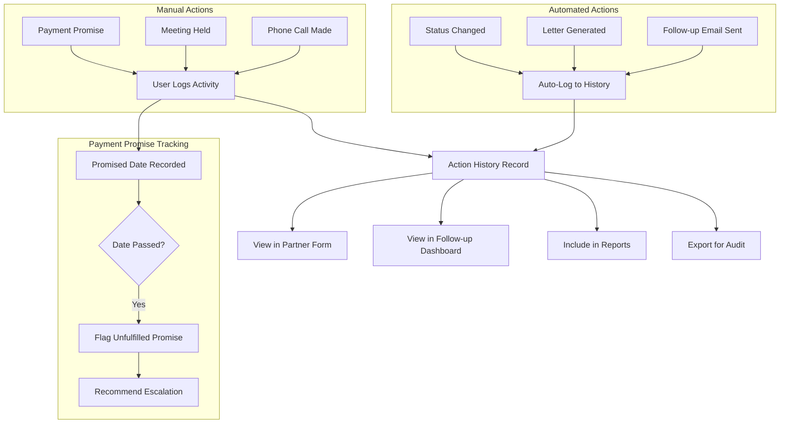

# PF-004: Action History Tracking

---

## Metadata

| Attribute | Value |
|-----------|-------|
| **Story ID** | PF-004 |
| **Title** | Action History Tracking |
| **Feature** | [FEATURE-006: Payment Follow-ups](../../features/FEATURE-006-payment-followups.md) |
| **Epic** | [EPIC-001: Enterprise Accounting Capabilities](../../EPIC-001-enterprise-accounting.md) |
| **Status** | Draft |
| **Priority** | Medium |
| **Story Points** | TBD (Implementation team to estimate) |
| **Personas** | Accountant, Credit Controller |
| **Created** | 2024 |
| **Last Updated** | 2024 |

---

## 1. User Story

### 1.1 Primary User Story

**As an** Accountant,

**I want** to view the complete history of follow-up actions taken for each customer,

**So that** I can understand the collection efforts made, avoid duplicate communications, and support customer inquiries about previous correspondence.

### 1.2 Secondary User Story

**As a** Credit Controller,

**I want** each follow-up action to be automatically logged with timestamp, action type, and responsible user,

**So that** I have a complete audit trail for compliance purposes and can analyze collection effectiveness.

---

## 2. Business Value

### 2.1 Value Statement

Action history tracking provides the foundation for effective collection management by enabling organizations to:

- **Maintain complete audit trail** of all collection activities for compliance and dispute resolution
- **Prevent duplicate communications** by showing which actions have already been taken
- **Support customer inquiries** by providing instant access to communication history
- **Analyze collection effectiveness** by tracking which actions lead to payment
- **Enable team collaboration** by sharing action context across users
- **Document promised payment dates** and customer commitments for follow-up

### 2.2 Success Metrics

| Metric | Target | Rationale |
|--------|--------|-----------|
| Action logging completeness | 100% of follow-up actions recorded | Complete audit trail requirement |
| History retrieval time | <2 seconds to load full customer history | Usability during customer calls |
| Dispute resolution support | All communications retrievable within 24 months | Regulatory compliance period |
| Manual activity logging | 100% of phone calls and meetings recordable | Comprehensive tracking |
| Export availability | History exportable within 30 seconds | Audit and legal support |

### 2.3 Business Rules

| Rule ID | Rule Description |
|---------|------------------|
| BR-001 | All automated follow-up actions (emails, status changes) must create a history record automatically |
| BR-002 | Manual activities (phone calls, meetings, notes) must be recordable with free-text notes |
| BR-003 | History records must be immutable once created (no deletion or modification of past entries) |
| BR-004 | History records must be preserved even if related invoices are cancelled or deleted |
| BR-005 | Each history record must capture: timestamp, action type, responsible user, follow-up level, and related invoices |
| BR-006 | Promised payment dates recorded in manual activities must be trackable for follow-up scheduling |
| BR-007 | History records must support attachment storage for relevant documents (call notes, agreements) |

---

## 3. Acceptance Criteria

> **Note:** All acceptance criteria follow BDD (Behavior-Driven Development) format using Given/When/Then syntax. Each scenario describes observable behavior without prescribing implementation details.

### Scenario 1: Automatic Action Logging

**Given** a follow-up action is executed (email sent, phone call logged, letter generated)

**When** the action completes successfully

**Then** a history record is created containing:
  - Timestamp of the action (date and time)
  - Action type (e.g., "Email Sent", "Phone Call", "Letter Generated", "Status Change")
  - Responsible user who initiated or triggered the action
  - Follow-up level that was applied
  - Customer/partner reference
  - Communication content summary (email subject, call outcome, etc.)

**And** the record is immediately visible in the customer's follow-up history

**And** the record includes a reference to the follow-up level configuration that triggered it

---

### Scenario 2: View Customer Action History

**Given** I am viewing a customer record with overdue invoices

**When** I access the follow-up history (via tab, smart button, or related view)

**Then** I see a chronological list of all follow-up actions with their details

**And** the list is sorted with the most recent actions first (descending date order)

**And** each entry displays:
  - Date and time of the action
  - Action type with appropriate visual indicator (icon or badge)
  - User who performed the action
  - Follow-up level (if applicable)
  - Summary of the action content

**And** I can expand any entry to see full details including attached documents and referenced invoices

---

### Scenario 3: Filter Action History by Type

**Given** I am viewing a customer's action history

**When** I filter by action type (e.g., "Email Sent", "Phone Call", "Letter", "Status Change")

**Then** only actions of the selected type are displayed

**And** the filter can be combined with date range filtering

**And** the filter selection persists during my session

**And** I can clear filters to return to the full history view

**Additional Filter Options:**
| Filter | Description |
|--------|-------------|
| Action Type | Email Sent, Phone Call, Letter, Meeting, Payment Promise, Status Change, Note |
| Date Range | From date / To date |
| User | Filter by responsible user |
| Follow-up Level | Filter by specific follow-up level |

---

### Scenario 4: Link Actions to Specific Invoices

**Given** a follow-up action is logged for specific overdue invoices

**When** I view the action history record

**Then** I can see which specific invoices were referenced in that follow-up action

**And** each invoice reference is clickable to navigate to the invoice record

**And** the invoice information shows:
  - Invoice number/reference
  - Invoice date
  - Due date
  - Amount due at the time of the action
  - Payment state at the time of the action

**And** I can see the aggregate overdue amount that was communicated

---

### Scenario 5: Record Manual Follow-up Activities

**Given** I have made a phone call or had a meeting about overdue payments

**When** I manually log the follow-up activity

**Then** I can record:
  - Activity type (Phone Call, Meeting, In-Person Visit, Other)
  - Date and time of the activity
  - Contact person reached (if different from primary contact)
  - Outcome/Result summary (free text)
  - Any promised payment date
  - Next action required
  - Private internal notes

**And** the activity is recorded in the history with my user attribution

**And** I can attach relevant documents (scanned agreements, meeting notes)

**And** promised payment dates create a follow-up reminder for the specified date

---

### Scenario 6: Export Action History

**Given** I am viewing a customer's action history

**When** I export the history

**Then** I receive a document containing all actions for the selected date range

**And** the export is available in common formats:
  - PDF format for formal documentation
  - Excel/CSV format for analysis

**And** the export includes:
  - Customer identification information
  - Complete action details for each entry
  - Invoice references per action
  - User attribution for each action
  - Attachments list (with links if digital export)

**And** the export is timestamped and includes generation details for audit purposes

---

### Scenario 7: View Email Content in History

**Given** an automated or manual follow-up email was sent to a customer

**When** I view the email action record in the history

**Then** I can see the complete email content that was sent

**And** I can see:
  - Email subject line
  - Recipients (To, CC)
  - Email body content (rendered HTML)
  - List of attachments that were included
  - Delivery status (Sent, Delivered, Failed)

**And** I can resend or forward the email content if needed

---

### Scenario 8: Track Payment Promises

**Given** I log a follow-up activity with a promised payment date

**When** the promised payment date arrives

**Then** the system flags customers with unfulfilled payment promises

**And** I can view a list of all outstanding payment promises

**And** each promise shows:
  - Original commitment date
  - Promised amount
  - Current payment status
  - Days since promise date
  - Follow-up recommendation

**And** unfulfilled promises can trigger escalated follow-up actions

---

## 4. Technical Notes

> **Purpose:** These notes guide implementing agents in their codebase analysis. Stories describe WHAT and WHY; implementation details emerge from agent discovery.

### 4.1 Codebase Analysis Areas

| File/Module | Analysis Purpose | Key Patterns to Reference |
|-------------|------------------|---------------------------|
| `addons/account/models/account_move.py` | Chatter integration patterns | Line 73: `_inherit = ['mail.thread.main.attachment', 'mail.activity.mixin']` - patterns for automatic message posting |
| `addons/mail/models/mail_message.py` | Message model structure | Understand message types, tracking, and storage |
| `addons/mail/models/mail_activity.py` | Activity scheduling patterns | Activity types, due dates, and user assignment |
| `addons/account/models/partner.py` | Partner model extension | Credit-related fields, existing computed fields for financial data |
| `addons/mail/models/mail_thread.py` | Thread mixin patterns | `message_post()` method for automatic logging |
| `addons/account/data/mail_template_data.xml` | Template patterns | Email template structure for follow-up communications |
| `ir.attachment` model | Attachment storage | Document attachment patterns for storing sent communications |

### 4.2 Design Considerations

| Consideration | Notes |
|---------------|-------|
| Model design | Evaluate dedicated `account.followup.history` model vs. using `mail.message` with subtype |
| Mail thread integration | Consider inheriting `mail.thread` on partner or creating followup-specific chatter |
| Activity mixin | Use `mail.activity.mixin` pattern for promised payment tracking |
| Immutability | History records should not be editable after creation (audit requirement) |
| Data retention | Consider archival policy for historical records (configurable retention period) |
| Performance | Index on partner_id and date fields for efficient history retrieval |

### 4.3 Action Type Taxonomy

Based on follow-up workflow analysis, recommended action types:

| Action Type | Code | Auto-Logged | Description |
|-------------|------|-------------|-------------|
| Email Sent | `email` | Yes | Automated or manual email communication |
| Phone Call | `phone` | No (Manual) | Telephone conversation with customer |
| Letter Sent | `letter` | Yes | Physical mail generated and sent |
| Meeting | `meeting` | No (Manual) | In-person or video meeting |
| Payment Promise | `promise` | No (Manual) | Customer commitment to pay by date |
| Status Change | `status` | Yes | Follow-up level change or status update |
| Internal Note | `note` | No (Manual) | Internal annotation without customer contact |
| SMS Sent | `sms` | Yes | Text message communication (if enabled) |

### 4.4 Integration Points

| Integration | Description |
|-------------|-------------|
| `mail.thread` | Leverage existing Odoo chatter for message history |
| `mail.activity` | Use activity framework for promised payment follow-ups |
| `mail.message` | Store communication records with proper subtype |
| `ir.attachment` | Store email content, attachments, and documents |
| `account.move` | Link history records to specific invoices |
| `res.partner` | Primary relationship for customer action history |
| PF-001 (Follow-up Levels) | Reference follow-up level in history records |
| PF-002 (Email Generation) | Automatically log sent emails in history |

### 4.5 Data Model Considerations

Based on source file analysis, recommended patterns:

| Field | Type | Purpose |
|-------|------|---------|
| `partner_id` | `fields.Many2one` | `res.partner` - customer reference |
| `action_type` | `fields.Selection` | Type of action (from taxonomy above) |
| `action_date` | `fields.Datetime` | When action occurred |
| `user_id` | `fields.Many2one` | `res.users` - responsible user |
| `followup_level_id` | `fields.Many2one` | Reference to follow-up level |
| `invoice_ids` | `fields.Many2many` | `account.move` - related invoices |
| `summary` | `fields.Text` | Brief description/outcome |
| `notes` | `fields.Html` | Detailed notes (HTML for formatting) |
| `promised_date` | `fields.Date` | Customer promised payment date |
| `promised_amount` | `fields.Monetary` | Promised payment amount |
| `mail_message_id` | `fields.Many2one` | `mail.message` - linked email message |
| `company_id` | `fields.Many2one` | `res.company` - multi-company support |

### 4.6 Audit Trail Considerations

| Requirement | Implementation Approach |
|-------------|------------------------|
| Immutability | Disable write/unlink on history model after creation |
| User tracking | Always capture `create_uid` and `create_date` |
| Invoice preservation | Store invoice snapshot data, not just reference |
| Data retention | Implement configurable archival (default: 7 years) |
| Export compliance | Support GDPR-compliant data export |

---

## 5. Dependencies

### 5.1 Story Dependencies

| Dependency Type | Related Item | Notes |
|-----------------|--------------|-------|
| **Depends On** | PF-001: Follow-up Level Configuration | Actions are recorded in context of follow-up levels |
| **Depends On** | PF-002: Automated Email Generation | Automated emails must be logged in history |

### 5.2 Downstream Dependencies

Stories that depend on PF-004:

| Story ID | Story Title | Dependency Reason |
|----------|-------------|-------------------|
| PF-003 | Follow-up Report Generation | Reports may include action history metrics |

### 5.3 External Dependencies

| Dependency | Description |
|------------|-------------|
| `mail.thread` | Odoo mail thread for chatter integration |
| `mail.message` | Message storage and tracking |
| `mail.activity` | Activity scheduling for payment promises |
| `ir.attachment` | Document and email attachment storage |
| `res.partner` | Partner model for customer relationship |
| `account.move` | Invoice model for linking to transactions |

---

## 6. Constraints

### 6.1 License Constraint

| Constraint | Requirement |
|------------|-------------|
| **Module License** | Module distributed under AGPL-3.0 compatible license |

### 6.2 Dependency Constraints

| Constraint | Requirement |
|------------|-------------|
| **No Enterprise Dependencies** | No imports or dependencies on Odoo Enterprise edition modules |
| **No account_followup Enterprise** | No dependency on Odoo Enterprise `account_followup` module |
| **OCA Compatibility** | Design compatible with OCA module patterns |

### 6.3 Coding Standards

| Constraint | Requirement |
|------------|-------------|
| **Odoo Guidelines** | Follow Odoo coding standards for model design |
| **OCA Standards** | Adhere to OCA module guidelines for potential contribution |
| **PEP 8 Compliance** | Python code follows PEP 8 style guide |
| **Pre-commit Hooks** | Code passes OCA pre-commit quality checks |

### 6.4 Data Integrity Constraints

| Constraint | Requirement |
|------------|-------------|
| **History Preservation** | Preserve action history even if related invoices are cancelled or deleted |
| **Immutability** | History records cannot be modified or deleted after creation |
| **Audit Compliance** | All records must include creation timestamp and user |
| **Data Retention** | Support configurable retention period (minimum 7 years default) |

### 6.5 Performance Constraints

| Constraint | Requirement |
|------------|-------------|
| **History Load Time** | Full customer history loads in <2 seconds |
| **Export Performance** | History export completes in <30 seconds for 2 years of data |
| **Search Performance** | Filtered searches return in <1 second |

---

## 7. Test Requirements

### 7.1 Coverage Requirements

| Requirement | Target |
|-------------|--------|
| **Minimum Test Coverage** | 80% code coverage for all action logging logic |
| **Unit Tests** | Required for all business logic methods |
| **Integration Tests** | Required for mail.thread and mail.activity integration |
| **Acceptance Tests** | BDD scenarios convertible to automated tests |

### 7.2 Test Scenarios

| Test Category | Test Scenarios |
|---------------|----------------|
| **Automatic Logging** | Verify history record created when automated email sent |
| **Automatic Logging** | Verify history record created on follow-up level change |
| **Manual Activity** | Test manual phone call logging with all fields |
| **Manual Activity** | Test promised payment date creates follow-up activity |
| **History Display** | Verify chronological ordering (most recent first) |
| **History Display** | Test filter by action type returns correct records |
| **History Display** | Test filter by date range returns correct records |
| **Invoice Linking** | Verify invoice references preserved when invoice cancelled |
| **Invoice Linking** | Test multiple invoices linked to single action |
| **Data Integrity** | Verify history records cannot be deleted |
| **Data Integrity** | Verify history records cannot be modified after creation |
| **Export** | Test PDF export contains all required fields |
| **Export** | Test CSV export format is valid and complete |
| **Performance** | Test history load time for customer with 100+ actions |
| **Email History** | Verify email content retrievable from history record |
| **Payment Promises** | Test unfulfilled promise flagging after date passes |

### 7.3 Edge Cases to Test

| Edge Case | Expected Behavior |
|-----------|-------------------|
| Customer with no history | Display empty state message, allow new entries |
| Invoice deleted after logging | History shows invoice reference with "Deleted" indicator |
| User who logged action is deactivated | History still shows user name with "Inactive" indicator |
| Very long action summary text | Properly truncated in list view, full text in detail |
| Concurrent action logging | Both actions recorded without data loss |
| Export with special characters | Properly encoded in PDF and CSV |
| Filter with no results | Display empty state with clear "no results" message |
| Attachment storage limit exceeded | Clear error message, prevent incomplete record |

---

## 8. User Interface Guidelines

> **Note:** These guidelines describe the user experience without prescribing specific implementation. UI implementation details emerge from agent discovery of existing Odoo patterns.

### 8.1 History Access Points

| Access Point | User Journey |
|--------------|--------------|
| Partner Form | Smart button showing action count, opens history view |
| Follow-up Dashboard | Quick access to recent actions across all customers |
| Invoice Form | Link to related follow-up history |

### 8.2 Action Entry Form

| UX Requirement | Description |
|----------------|-------------|
| Action type selection | Clear visual distinction between action types |
| Date/time defaulting | Default to current date/time for manual entries |
| Invoice selection | Multi-select widget for linking related invoices |
| Promised date calendar | Calendar picker with clear date indication |
| Notes formatting | Rich text editor for detailed notes |
| Attachment upload | Drag-and-drop file attachment support |

### 8.3 History List View

| UX Requirement | Description |
|----------------|-------------|
| Visual action types | Icons or colored badges for quick type identification |
| Expandable details | Click to expand full details without page navigation |
| Filter persistence | Filters remain active during browsing session |
| Quick actions | Buttons for common actions (view email, log follow-up) |
| Responsive design | Usable on tablets for field sales representatives |

---

## 9. Workflow Diagram

---

## 10. Acceptance Criteria Traceability

| Scenario | Success Metric | Feature Requirement |
|----------|----------------|---------------------|
| Scenario 1 | Action logging completeness = 100% | CAP-004: Track complete action history |
| Scenario 2 | History retrieval time <2 seconds | Performance requirement |
| Scenario 3 | Filter functionality | Usability requirement |
| Scenario 4 | Invoice linkage | CAP-004: Per-partner tracking |
| Scenario 5 | Manual activity logging | CAP-006: Support manual follow-up actions |
| Scenario 6 | Export for audit | Dispute resolution support |
| Scenario 7 | Email content viewing | Communication audit trail |
| Scenario 8 | Payment promise tracking | Collection effectiveness analysis |

---

## 11. References

### 11.1 Related Documentation

| Document | Purpose |
|----------|---------|
| [EPIC-001: Enterprise Accounting](../../EPIC-001-enterprise-accounting.md) | Parent epic context |
| [FEATURE-006: Payment Follow-ups](../../features/FEATURE-006-payment-followups.md) | Feature specification |
| [PF-001: Follow-up Level Configuration](./PF-001-followup-level-configuration.md) | Upstream dependency |
| [PF-002: Automated Email Generation](./PF-002-automated-email-generation.md) | Integration dependency |

### 11.2 Odoo Source References

| File | Reference Purpose |
|------|-------------------|
| `addons/account/models/partner.py` | Partner credit data patterns |
| `addons/account/models/account_move.py` | Mail thread integration patterns |
| `addons/account/data/mail_template_data.xml` | Email template patterns |
| `addons/mail/models/mail_activity.py` | Activity scheduling framework |
| `addons/mail/models/mail_message.py` | Message storage patterns |

### 11.3 External Standards

| Standard | Application |
|----------|-------------|
| GDPR | Data export and retention requirements |
| SOX (Sarbanes-Oxley) | Audit trail requirements for US companies |
| Local tax regulations | Document retention periods vary by jurisdiction |

---

*Last Updated: 2024*
*Status: Draft - Ready for Implementation*
