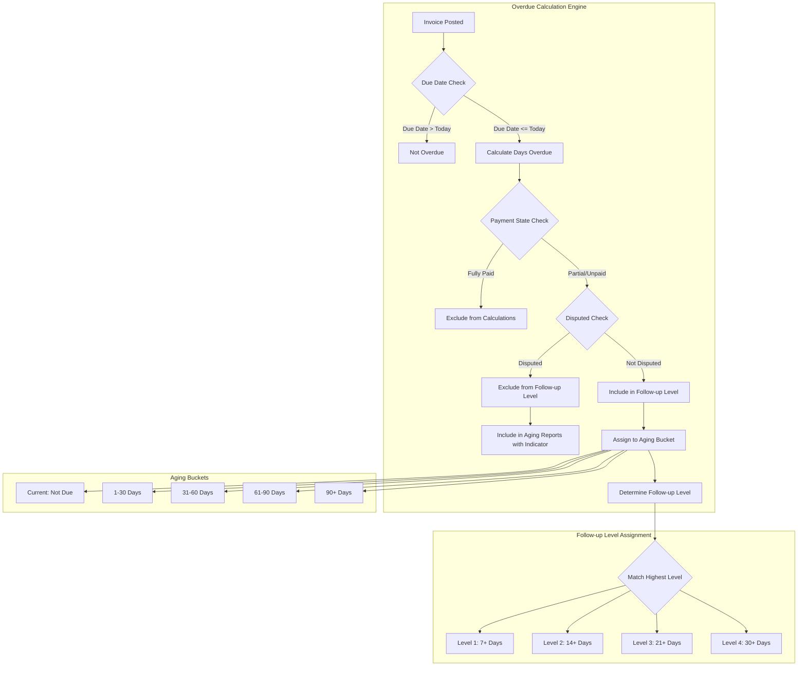

# PF-005: Overdue Calculation

---

## Metadata

| Attribute | Value |
|-----------|-------|
| **Story ID** | PF-005 |
| **Title** | Overdue Calculation |
| **Parent Feature** | [FEATURE-006: Payment Follow-ups](../../features/FEATURE-006-payment-followups.md) |
| **Parent Epic** | [EPIC-001: Enterprise Accounting Capabilities](../../EPIC-001-enterprise-accounting.md) |
| **Status** | Draft |
| **Priority** | High |
| **Story Points** | TBD |
| **Last Updated** | 2024 |

---

## 1. User Story

### 1.1 Primary User Story

**As an** Accountant

**I want** the system to automatically calculate which invoices are overdue and for how long

**So that** I can identify customers requiring follow-up and determine the appropriate follow-up level based on days overdue

### 1.2 Secondary User Story

**As a** Business Owner

**I want** to see aging buckets showing how much is overdue by time period (Current, 1-30 days, 31-60 days, 61-90 days, 90+ days)

**So that** I can understand the severity of receivables aging and its impact on cash flow

---

## 2. Acceptance Criteria

> **Note:** All acceptance criteria follow BDD (Behavior-Driven Development) format using Given/When/Then syntax. Each scenario describes observable behavior without prescribing implementation details.

### Scenario 1: Calculate Days Overdue

**Given** an invoice has a due date and the invoice is not fully paid

**When** the overdue calculation runs

**Then** the number of days overdue is calculated as (current date - due date) for invoices past due date

**And** invoices with due dates in the future are not marked as overdue

**And** the days overdue value is zero or positive (never negative)

---

### Scenario 2: Assign Customer Follow-up Level

**Given** follow-up levels are configured with day thresholds (e.g., Level 1: 7 days, Level 2: 14 days, Level 3: 21 days, Level 4: 30 days)

**When** a customer has overdue invoices

**Then** the customer is assigned to the follow-up level matching their most overdue invoice's days overdue

**And** the customer's follow-up level is the highest applicable level based on all their overdue invoices

**And** a customer with no overdue invoices is not assigned to any follow-up level

---

### Scenario 3: Calculate Aging Buckets

**Given** a customer has multiple overdue invoices with varying due dates

**When** I view the customer's aging information

**Then** I see the total overdue amount distributed across aging buckets:
  - **Current**: Not yet due (due date >= today)
  - **1-30 days**: 1 to 30 days past due
  - **31-60 days**: 31 to 60 days past due
  - **61-90 days**: 61 to 90 days past due
  - **90+ days**: More than 90 days past due

**And** each bucket shows the sum of remaining unpaid amounts for invoices in that aging range

**And** the total of all buckets equals the customer's total receivable balance

---

### Scenario 4: Exclude Disputed Invoices from Follow-up Level

**Given** an invoice is marked as disputed or under review

**When** the overdue calculation runs

**Then** the disputed invoice is excluded from follow-up level calculation

**And** the disputed invoice still appears in aging reports with a dispute indicator

**And** the customer's follow-up level is calculated based on non-disputed invoices only

---

### Scenario 5: Handle Partial Payments

**Given** an invoice has partial payments applied

**When** the overdue calculation runs

**Then** only the remaining unpaid amount (amount residual) is considered overdue

**And** the original invoice total is not used for aging calculations

**And** invoices that are fully paid (amount residual = 0) are excluded from overdue calculations

---

### Scenario 6: Recalculate on Invoice and Payment Changes

**Given** a customer's follow-up level has been calculated

**When** a payment is recorded against one of the customer's invoices

**Then** the customer's overdue status and follow-up level are automatically recalculated

---

**Given** a customer's follow-up level has been calculated

**When** an invoice is modified (due date changed, amount adjusted, or cancelled)

**Then** the customer's overdue status and follow-up level are automatically recalculated

---

**Given** a customer's follow-up level has been calculated

**When** a new overdue invoice is posted for the customer

**Then** the customer's overdue status and follow-up level are automatically recalculated to include the new invoice

---

## 3. Business Rules

| Rule ID | Business Rule | Rationale |
|---------|---------------|-----------|
| BR-001 | Days overdue is calculated from invoice due date, not invoice date | Due date reflects agreed payment terms |
| BR-002 | Only posted (confirmed) invoices are considered for overdue calculations | Draft/cancelled invoices are not legally binding |
| BR-003 | Customer follow-up level is based on their most overdue invoice | Ensures escalation reflects worst-case receivable status |
| BR-004 | Aging buckets use remaining amount, not original invoice amount | Partial payments should reduce aging exposure |
| BR-005 | Disputed invoices are tracked separately from collectible overdue | Prevents inappropriate collection actions on disputed items |
| BR-006 | Credit notes reduce total receivable but don't clear specific invoice aging | Standard accounting practice for credit application |

---

## 4. Technical Discovery Notes

> **Purpose:** These notes guide implementing agents in their codebase analysis before making implementation decisions. User stories describe WHAT and WHY; implementation details emerge from agent discovery of the codebase.

### 4.1 Codebase Analysis Areas

| Area | File/Location | Discovery Questions |
|------|---------------|---------------------|
| Receivable Calculation | `addons/account/models/partner.py` lines 365-407 | How does `_credit_debit_get` compute partner receivables? What SQL patterns are used for performance? |
| Amount Residual | `addons/account/models/account_move_line.py` lines 241-253 | How is `amount_residual` computed and stored? How does `reconciled` flag work? |
| Days Sales Outstanding | `addons/account/models/partner.py` lines 471-489 | How is DSO calculated? What patterns can be reused for aging? |
| Invoice Due Date | `addons/account/models/account_move.py` lines 378-383 | How is `invoice_date_due` computed from payment terms? |
| Payment State | `addons/account/models/account_move.py` lines 47-55, 598-605 | What are valid payment states? How is partial payment tracked? |
| Company Currency | `addons/account/models/partner.py` lines 495-500 | How should multi-currency amounts be handled? |

### 4.2 Key Fields and Methods to Analyze

**From `account.move` (Invoice Model):**
- `invoice_date_due` - Invoice due date computed from payment terms
- `amount_residual` - Remaining unpaid amount
- `payment_state` - Current payment status (not_paid, partial, paid, etc.)
- `state` - Document state (draft, posted, cancel)
- `move_type` - Document type (out_invoice, out_refund, in_invoice, etc.)

**From `account.move.line` (Invoice Line Model):**
- `amount_residual` - Line-level residual for reconciliation
- `reconciled` - Boolean indicating full reconciliation
- `account_type` - Account type (asset_receivable, liability_payable)
- `matched_debit_ids` / `matched_credit_ids` - Reconciliation links

**From `res.partner` (Customer Model):**
- `credit` - Total receivable balance (computed field)
- `debit` - Total payable balance (computed field)
- `days_sales_outstanding` - DSO metric (computed field)
- SQL patterns in `_credit_debit_get` for efficient receivable queries

### 4.3 Performance Considerations

- Reference SQL optimization patterns from `partner.py` `_credit_debit_get` method
- Consider whether aging calculations should be stored fields vs. computed on-demand
- Evaluate impact of recalculation triggers on database performance
- Plan for scalability with 10,000+ invoices per company
- Consider batch processing for scheduled recalculations vs. real-time triggers

### 4.4 OCA Module Compatibility

- Review `OCA/account-financial-reporting` for aged partner balance report patterns
- Evaluate `OCA/account-payment` for payment follow-up patterns
- Consider compatibility with `OCA/account-reconcile` for reconciliation workflows

---

## 5. Dependencies

### 5.1 Story Dependencies

| Dependency Type | Story/Feature | Description |
|-----------------|---------------|-------------|
| **Required By** | PF-001: Follow-up Level Configuration | Provides follow-up level thresholds used for level assignment |
| **Required For** | PF-002: Automated Email Generation | Overdue calculation determines which customers need follow-up emails |
| **Required For** | PF-003: Follow-up Report Generation | Aging calculations feed into follow-up reports |
| **Required For** | PF-004: Action History Tracking | Follow-up level changes trigger action logging |

### 5.2 Module Dependencies

| Module | Purpose | Status |
|--------|---------|--------|
| `account` | Core accounting models (account.move, account.move.line) | Existing - Required |
| `base` | Partner model (res.partner) | Existing - Required |

### 5.3 External Dependencies

| Standard/Reference | Purpose |
|--------------------|---------|
| Standard aging buckets (30/60/90 days) | Industry-standard receivables aging periods |

---

## 6. Constraints

### 6.1 License Requirements

| Constraint | Requirement | Status |
|------------|-------------|--------|
| **AGPL-3.0 Compatibility** | Module distributed under AGPL-3.0 compatible license | ☐ Required |
| **Base Module License** | Respect LGPL-3 licensing of existing `account` module | ☐ Required |

**Acceptance Criterion:** Module distributed under AGPL-3.0 compatible license.

### 6.2 Dependency Restrictions

| Constraint | Requirement | Status |
|------------|-------------|--------|
| **No Enterprise Dependencies** | Zero imports from Odoo Enterprise Edition modules | ☐ Required |
| **No account_followup Enterprise** | Specifically no dependency on Enterprise `account_followup` module | ☐ Required |
| **OCA Compatibility** | Implementation compatible with OCA module ecosystem | ☐ Required |

**Acceptance Criterion:** No imports or dependencies on Odoo Enterprise edition modules.

### 6.3 Coding Standards

| Constraint | Requirement | Status |
|------------|-------------|--------|
| **Odoo Guidelines** | Follow Odoo coding standards | ☐ Required |
| **OCA Standards** | Adhere to OCA module guidelines for computation methods | ☐ Required |
| **PEP 8 Compliance** | Python code follows PEP 8 | ☐ Required |

**Acceptance Criterion:** Code passes OCA quality checks (pre-commit hooks, pylint-odoo).

### 6.4 Performance Constraints

| Constraint | Requirement | Rationale |
|------------|-------------|-----------|
| **Multi-Currency Support** | Calculations use company currency for consistency | Required for multi-currency environments |
| **Large Dataset Performance** | Maintain performance for companies with 10,000+ invoices | Scalability for enterprise use |
| **Efficient Queries** | No N+1 query patterns in aging calculations | Database performance optimization |

**Acceptance Criterion:** Overdue calculation processing completes in reasonable time for large invoice volumes.

---

## 7. Test Requirements

### 7.1 Coverage Requirements

| Requirement | Target | Status |
|-------------|--------|--------|
| **Minimum Test Coverage** | 80% for overdue calculation logic | ☐ Required |
| **Unit Tests** | All calculation methods | ☐ Required |
| **Integration Tests** | Invoice/payment change triggers | ☐ Required |

### 7.2 Test Scenarios

| Test ID | Test Scenario | Acceptance Criteria Reference |
|---------|---------------|------------------------------|
| TC-001 | Test days overdue calculation accuracy | Scenario 1 |
| TC-002 | Test invoice due date in future (not overdue) | Scenario 1 |
| TC-003 | Test follow-up level assignment based on thresholds | Scenario 2 |
| TC-004 | Test customer with multiple overdue invoices gets highest level | Scenario 2 |
| TC-005 | Test aging bucket distribution (Current, 1-30, 31-60, 61-90, 90+) | Scenario 3 |
| TC-006 | Test aging bucket totals match total receivable | Scenario 3 |
| TC-007 | Test disputed invoice exclusion from follow-up level | Scenario 4 |
| TC-008 | Test disputed invoice appears in aging with indicator | Scenario 4 |
| TC-009 | Test partial payment reduces overdue amount | Scenario 5 |
| TC-010 | Test fully paid invoice excluded from calculations | Scenario 5 |
| TC-011 | Test recalculation when payment recorded | Scenario 6 |
| TC-012 | Test recalculation when invoice modified | Scenario 6 |
| TC-013 | Test recalculation when new invoice posted | Scenario 6 |
| TC-014 | Test performance with large dataset (1,000+ invoices) | Performance constraint |
| TC-015 | Test multi-currency invoice conversion to company currency | Multi-currency constraint |

### 7.3 Edge Cases to Test

| Edge Case | Expected Behavior |
|-----------|-------------------|
| Invoice due today | Not considered overdue (days overdue = 0) |
| Invoice due yesterday | Overdue by 1 day |
| Invoice with zero amount | Excluded from calculations |
| Invoice fully credited | Excluded from calculations (amount_residual = 0) |
| Customer with only draft invoices | No overdue status |
| No follow-up levels configured | Graceful handling, no level assigned |
| Invoice in foreign currency | Convert to company currency for calculations |

---

## 8. Definition of Done

- [ ] All 6 acceptance criteria scenarios pass testing
- [ ] Minimum 80% test coverage achieved for overdue calculation logic
- [ ] No dependencies on Odoo Enterprise modules
- [ ] AGPL-3.0 license compliance verified
- [ ] Code follows OCA coding standards (pre-commit, pylint-odoo pass)
- [ ] Multi-currency calculations work correctly
- [ ] Performance acceptable with 10,000+ invoices
- [ ] Integration with PF-001 (follow-up level configuration) verified
- [ ] Documentation/docstrings complete for public methods

---

## 9. INVEST Criteria Validation

| Criterion | Assessment | Notes |
|-----------|------------|-------|
| **Independent** | ✓ | Can be developed independently; provides foundation for other stories |
| **Negotiable** | ✓ | Describes outcomes (what), not implementation (how) |
| **Valuable** | ✓ | Clear business value: identify overdue customers for follow-up |
| **Estimable** | ✓ | Well-scoped calculation engine with clear boundaries |
| **Small** | ✓ | Focused on calculation logic only; UI and actions in other stories |
| **Testable** | ✓ | All scenarios have measurable, verifiable outcomes |

---

## 10. Related Documentation

### 10.1 Feature Documentation
- [FEATURE-006: Payment Follow-ups](../../features/FEATURE-006-payment-followups.md)

### 10.2 Related Stories
- [PF-001: Follow-up Level Configuration](./PF-001-followup-level-configuration.md) - Provides level thresholds
- [PF-002: Automated Email Generation](./PF-002-automated-email-generation.md) - Uses overdue data
- [PF-003: Follow-up Report Generation](./PF-003-followup-report-generation.md) - Uses aging data
- [PF-004: Action History Tracking](./PF-004-action-history-tracking.md) - Logs level changes

### 10.3 External References
- [OCA account-financial-reporting](https://github.com/OCA/account-financial-reporting) - Aged partner balance patterns
- [Odoo Account Module Documentation](https://www.odoo.com/documentation/18.0/applications/finance/accounting.html)

---

## 11. Revision History

| Version | Date | Author | Changes |
|---------|------|--------|---------|
| 1.0 | 2024 | Enterprise Accounting Team | Initial story creation |

---

## 12. Workflow Diagram

---

## 13. Aging Bucket Example

| Customer | Invoice | Due Date | Days Overdue | Amount Due | Aging Bucket |
|----------|---------|----------|--------------|------------|--------------|
| ABC Corp | INV-001 | Future | 0 | $1,000 | Current |
| ABC Corp | INV-002 | 15 days ago | 15 | $2,500 | 1-30 Days |
| ABC Corp | INV-003 | 45 days ago | 45 | $3,000 | 31-60 Days |
| ABC Corp | INV-004 | 75 days ago | 75 | $1,500 | 61-90 Days |
| ABC Corp | INV-005 | 120 days ago | 120 | $500 | 90+ Days |
| **Totals** | | | | **$8,500** | |

**Follow-up Level Assignment for ABC Corp:**
- Most overdue invoice: INV-005 at 120 days
- Applicable follow-up level: Level 4 (30+ days threshold)
- Result: ABC Corp assigned to Level 4 - Final Notice

---

*This user story is part of the Enterprise Accounting Capabilities epic for Odoo Community Edition.*
