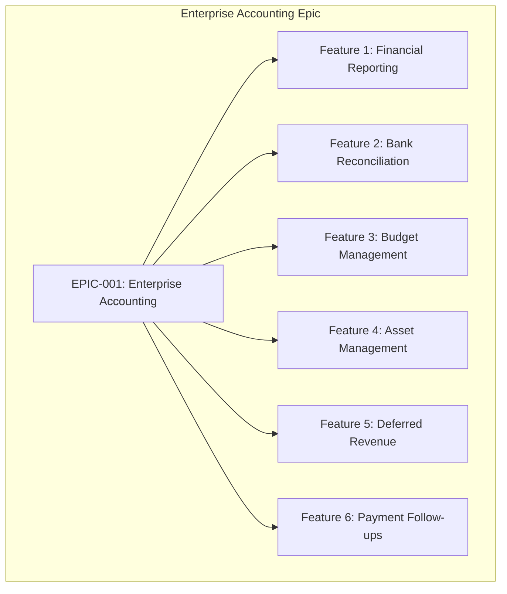
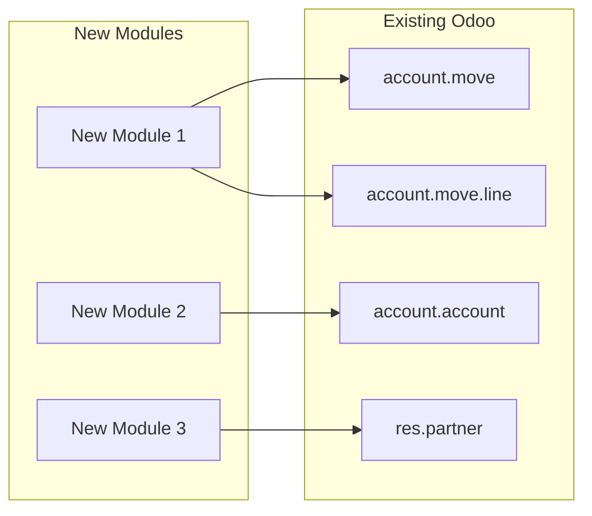

# [EPIC-NNN] [Epic Title]

> **Reusable Epic Documentation Template**
> 
> This template provides a consistent structure for documenting master epics that encompass multiple features and user stories. Copy this template and replace all placeholders (indicated by `[brackets]`) with actual content.

---

## Metadata

| Attribute | Value |
|-----------|-------|
| **Epic ID** | `[EPIC-NNN]` |
| **Title** | [Epic Title] |
| **Status** | Draft / Planning / In Progress / Complete |
| **Version** | [X.Y] |
| **Last Updated** | [YYYY-MM-DD] |
| **Owner/Author** | [Name / Team] |
| **Target Completion** | [YYYY-QN or specific date] |

---

## 1. Executive Summary

### 1.1 Overview

[Provide a brief 2-3 sentence overview of the epic's purpose. This should clearly communicate the high-level goal without getting into implementation details.]

**Example:**
> This epic delivers enterprise-grade accounting capabilities to Odoo Community Edition, bridging the feature gap with Enterprise Edition. It enables SMEs to produce compliant financial reports, automate bank reconciliation, manage budgets, track assets, handle deferred revenue, and streamline payment follow-ups.

### 1.2 Key Business Value

[State the primary business value this epic delivers. Focus on outcomes, not outputs.]

**Example:**
> Enables small and medium enterprises using Odoo Community Edition to meet regulatory compliance requirements, secure bank financing, and improve financial management without requiring expensive Enterprise licenses.

### 1.3 Target Completion Timeframe

| Milestone | Target Date | Description |
|-----------|-------------|-------------|
| Planning Complete | [YYYY-MM-DD] | All stories written and prioritized |
| Development Start | [YYYY-MM-DD] | First feature begins implementation |
| MVP Release | [YYYY-MM-DD] | Core features available for testing |
| Full Release | [YYYY-MM-DD] | All features complete and tested |

---

## 2. Business Context

### 2.1 Problem Statement

[Describe the business problem being solved. Be specific about who is affected and what challenges they face.]

**Template:**
> [Target users] using [system/context] cannot [desired capability] because [current limitation]. This results in [negative business impact].

**Example:**
> SMEs using Odoo Community Edition cannot produce standard financial reports required for regulatory compliance, investor reporting, bank loan applications, and internal financial management. The Enterprise Edition's accounting features are cost-prohibitive for many organizations.

### 2.2 Business Impact

[Quantify the impact if this problem remains unsolved. Use metrics where possible.]

| Impact Area | Current State | Consequence |
|-------------|---------------|-------------|
| [Area 1] | [Current situation] | [Quantified impact] |
| [Area 2] | [Current situation] | [Quantified impact] |
| [Area 3] | [Current situation] | [Quantified impact] |

**Example:**

| Impact Area | Current State | Consequence |
|-------------|---------------|-------------|
| Compliance | Manual report generation | 40+ hours/quarter spent on manual compilation |
| Bank Relations | No standard statements | Loan applications delayed or rejected |
| Cash Flow | Manual reconciliation | 5-10 days to identify discrepancies |
| Asset Tracking | Spreadsheet-based | Depreciation errors, audit findings |

### 2.3 Proposed Solution

[Provide a high-level approach without prescribing implementation details. Focus on capabilities, not technical architecture.]

**Template:**
> Develop [solution type] that enables [target users] to [key capabilities]. The solution will [key differentiators].

**Example:**
> Develop a suite of accounting modules for Odoo Community Edition that enables finance teams to generate GAAP/IFRS-compliant reports, automate bank reconciliation, manage budgets with variance analysis, track fixed assets with automated depreciation, handle deferred revenue per recognition standards, and automate payment follow-ups.

### 2.4 Strategic Alignment

[Explain how this epic aligns with broader organizational or product goals.]

| Strategic Goal | Alignment |
|----------------|-----------|
| [Goal 1] | [How this epic supports it] |
| [Goal 2] | [How this epic supports it] |
| [Goal 3] | [How this epic supports it] |

---

## 3. Target Users

### 3.1 User Personas

| Persona | Role Description | Primary Needs | Features of Interest |
|---------|------------------|---------------|---------------------|
| [Persona 1] | [Brief role description] | [Key needs/goals] | [Relevant features] |
| [Persona 2] | [Brief role description] | [Key needs/goals] | [Relevant features] |
| [Persona 3] | [Brief role description] | [Key needs/goals] | [Relevant features] |
| [Persona 4] | [Brief role description] | [Key needs/goals] | [Relevant features] |
| [Persona 5] | [Brief role description] | [Key needs/goals] | [Relevant features] |

**Standard Accounting Personas (customize as needed):**

| Persona | Role Description | Primary Needs | Features of Interest |
|---------|------------------|---------------|---------------------|
| CFO / Finance Director | Executive responsible for financial strategy and reporting | GAAP/IFRS-compliant reporting, cash flow visibility, strategic insights | Financial Reporting, Budget Management, Deferred Revenue |
| Accountant / Bookkeeper | Day-to-day financial operations and transaction processing | Efficient workflows, accurate records, period close | Bank Reconciliation, Asset Management, Payment Follow-ups |
| Controller | Budget oversight and variance management | Budget monitoring, variance analysis, alerts | Budget Management |
| Auditor | Transaction verification and compliance review | Data integrity, transaction trails, drill-down | Financial Reporting (General Ledger, Trial Balance) |
| Business Owner | Overall business health and cash position | Cash flow statements, aged receivables, AR management | Financial Reporting, Payment Follow-ups |

### 3.2 Persona Customization Notes

[Add notes about how to customize the persona list for specific epics:]

- Remove personas not relevant to the epic's scope
- Add domain-specific personas as needed (e.g., Tax Specialist, Payroll Administrator)
- Ensure each feature maps to at least one persona
- Consider both primary and secondary user interactions

---

## 4. Success Metrics

### 4.1 Measurable Outcomes

| Metric ID | Metric Description | Target Value | Measurement Method |
|-----------|-------------------|--------------|-------------------|
| M-001 | [Metric description] | [Quantified target] | [How it will be measured] |
| M-002 | [Metric description] | [Quantified target] | [How it will be measured] |
| M-003 | [Metric description] | [Quantified target] | [How it will be measured] |
| M-004 | [Metric description] | [Quantified target] | [How it will be measured] |
| M-005 | [Metric description] | [Quantified target] | [How it will be measured] |
| M-006 | [Metric description] | [Quantified target] | [How it will be measured] |

**Example Success Metrics:**

| Metric ID | Metric Description | Target Value | Measurement Method |
|-----------|-------------------|--------------|-------------------|
| M-001 | All standard financial statements producible | 100% coverage (Balance Sheet, P&L, Cash Flow) | Feature completion checklist |
| M-002 | Bank reconciliation matching accuracy | ≥95% algorithmic match rate | Automated matching vs. manual reconciliation comparison |
| M-003 | Budget variance reports availability | Within 24 hours of period close | Time from period close to report generation |
| M-004 | Asset depreciation automation | 100% automated entry generation | Scheduled job success rate |
| M-005 | Deferred revenue compliance | ASC 606 / IFRS 15 compliant | Audit verification |
| M-006 | Overdue receivables reduction | 15-25% reduction | AR aging comparison (before/after) |

### 4.2 Success Metric Guidelines

- **Metrics should be user-outcome focused**, not implementation-focused
- Each metric should be objectively measurable
- Include both leading indicators (process metrics) and lagging indicators (outcome metrics)
- Ensure metrics align with the business value statement
- Consider metrics for each major feature area

---

## 5. Features

### 5.1 Feature Summary

| Feature ID | Feature Name | Story Count | Priority | Status | Link |
|------------|--------------|-------------|----------|--------|------|
| [FEATURE-001] | [Feature Name] | [N] stories | Critical / High / Medium / Low | Not Started / In Progress / Complete | [Link to feature file](./features/FEATURE-001-[slug].md) |
| [FEATURE-002] | [Feature Name] | [N] stories | Critical / High / Medium / Low | Not Started / In Progress / Complete | [Link to feature file](./features/FEATURE-002-[slug].md) |
| [FEATURE-003] | [Feature Name] | [N] stories | Critical / High / Medium / Low | Not Started / In Progress / Complete | [Link to feature file](./features/FEATURE-003-[slug].md) |
| [FEATURE-004] | [Feature Name] | [N] stories | Critical / High / Medium / Low | Not Started / In Progress / Complete | [Link to feature file](./features/FEATURE-004-[slug].md) |
| [FEATURE-005] | [Feature Name] | [N] stories | Critical / High / Medium / Low | Not Started / In Progress / Complete | [Link to feature file](./features/FEATURE-005-[slug].md) |
| [FEATURE-006] | [Feature Name] | [N] stories | Critical / High / Medium / Low | Not Started / In Progress / Complete | [Link to feature file](./features/FEATURE-006-[slug].md) |

**Total Stories:** [NN] stories across [N] features

### 5.2 Priority Definitions

| Priority | Definition | Criteria |
|----------|------------|----------|
| **Critical** | Must have for MVP | Core functionality; blocking for release |
| **High** | Important for initial release | Significant business value; expected by users |
| **Medium** | Desired for complete solution | Enhances user experience; nice to have |
| **Low** | Future consideration | Can be deferred to later releases |

### 5.3 Feature Decomposition Guidelines

Per INVEST principles, each feature should decompose into **3-7 user stories**:

- **Too few stories** (<3): Feature may be too granular; consider merging with related feature
- **Optimal range** (3-7): Feature is well-scoped for independent delivery
- **Too many stories** (>7): Feature may be too broad; consider splitting into sub-features

---

## 6. Epic-Feature Relationship Diagram

```mermaid
graph TB
    subgraph [Epic Title]
        E[EPIC-NNN: Epic Name]
        E --> F1[Feature 1: Feature Name]
        E --> F2[Feature 2: Feature Name]
        E --> F3[Feature 3: Feature Name]
        E --> F4[Feature 4: Feature Name]
        E --> F5[Feature 5: Feature Name]
        E --> F6[Feature 6: Feature Name]
    end
```

**Diagram Customization:**

Replace the placeholder content above with actual feature information:



---

## 7. Constraints

### 7.1 License Requirements

| Constraint | Requirement | Rationale |
|------------|-------------|-----------|
| **License Compatibility** | AGPL-3.0 | All new modules must be distributed under AGPL-3.0 compatible license to ensure open-source compliance and community contribution |
| **Existing License Respect** | LGPL-3 (base modules) | Integration with existing Odoo modules must respect their LGPL-3 licensing |

**Acceptance Criterion:** Module distributed under AGPL-3.0 compatible license.

### 7.2 Dependency Restrictions

| Constraint | Requirement | Rationale |
|------------|-------------|-----------|
| **No Enterprise Dependencies** | Zero imports from Enterprise Edition | Ensures solution works for Community Edition users without requiring Enterprise licenses |
| **OCA Compatibility** | Compatible with OCA modules | Allows integration with existing OCA ecosystem where applicable |

**Acceptance Criterion:** No imports or dependencies on Odoo Enterprise edition modules.

### 7.3 Coding Standards

| Constraint | Requirement | Rationale |
|------------|-------------|-----------|
| **Odoo Guidelines** | Follow Odoo coding standards | Ensures consistency with Odoo ecosystem and maintainability |
| **OCA Standards** | Adhere to OCA module guidelines | Enables potential contribution to OCA repositories |
| **PEP 8 Compliance** | Python code follows PEP 8 | Standard Python style guide compliance |

**Acceptance Criterion:** Code passes OCA quality checks (pre-commit hooks, pylint-odoo).

### 7.4 Test Coverage

| Constraint | Requirement | Rationale |
|------------|-------------|-----------|
| **Minimum Coverage** | 80% test coverage | Ensures reliability and maintainability |
| **Test Types** | Unit, Integration, Acceptance | Comprehensive testing at all levels |
| **BDD Alignment** | Tests match acceptance criteria | Ensures stories are verifiable |

**Acceptance Criterion:** Implementation achieves minimum 80% test coverage for new functionality.

### 7.5 Version Compatibility

| Constraint | Requirement | Rationale |
|------------|-------------|-----------|
| **Target Version** | Odoo [XX.0] | [Specify target Odoo version] |
| **Repository Version** | [Note any discrepancy] | [Explain migration considerations if needed] |
| **Python Version** | Python 3.10+ | Odoo version-dependent requirement |

**Note:** If the target version differs from the repository version, implementation agents should note potential migration considerations in their discovery phase.

---

## 8. Out of Scope

### 8.1 Explicitly Excluded Items

The following items are **explicitly out of scope** for this epic:

| Excluded Item | Rationale |
|---------------|-----------|
| [Item 1] | [Reason for exclusion] |
| [Item 2] | [Reason for exclusion] |
| [Item 3] | [Reason for exclusion] |
| [Item 4] | [Reason for exclusion] |
| [Item 5] | [Reason for exclusion] |

**Example Exclusions:**

| Excluded Item | Rationale |
|---------------|-----------|
| Real-time bank feed API integrations (Plaid, Yodlee, Saltedge) | Requires third-party contracts; separate epic for API integrations |
| AI/ML-powered OCR invoice recognition | Requires ML infrastructure; technology selection deferred |
| Multi-company consolidation with intercompany eliminations | Complex feature warranting separate epic |
| Tax service integrations (TaxCloud, AvaTax) | Depends on regional requirements; separate localization epic |
| Mobile-specific interfaces | Mobile strategy deferred; web-responsive approach first |

### 8.2 Scope Boundary Guidelines

- Out-of-scope items prevent scope creep during implementation
- Items may be candidates for future epics
- Clear exclusions help stakeholders understand boundaries
- Review out-of-scope items if requirements change significantly

---

## 9. Discovery Notes (For Implementing Agents)

> **Purpose:** These discovery notes guide implementing agents in their codebase analysis before making implementation decisions. User stories describe WHAT and WHY; implementation details emerge from agent discovery.

### 9.1 D-001: Existing Patterns Analysis

**Discovery Requirement:**
> Analyze current module structure, model inheritance patterns, view architecture, and wizard conventions before proposing new modules or extensions.

**Analysis Areas:**
- [ ] Review existing model structures in relevant modules
- [ ] Document inheritance patterns (delegation, classical, extension)
- [ ] Analyze view architecture and XML patterns
- [ ] Study wizard implementation conventions
- [ ] Identify reusable components and mixins

**Key Files to Examine:**
- `addons/[module]/models/*.py`
- `addons/[module]/views/*.xml`
- `addons/[module]/wizard/*.py`
- `addons/[module]/__manifest__.py`

### 9.2 D-002: OCA Compatibility Strategy

**Discovery Requirement:**
> Review relevant OCA modules to determine integration vs. replacement strategy for overlapping functionality.

**Analysis Areas:**
- [ ] Identify OCA modules with similar functionality
- [ ] Evaluate integration opportunities
- [ ] Assess replacement considerations
- [ ] Document compatibility requirements

**OCA Repositories to Review:**
- [List relevant OCA repositories]
- Check module versions and Odoo compatibility
- Review open issues and pull requests

### 9.3 D-003: Report Engine Decision

**Discovery Requirement:**
> Determine whether to extend existing Odoo reporting infrastructure or implement dedicated report engine based on codebase analysis.

**Analysis Areas:**
- [ ] Review existing QWeb report implementations
- [ ] Analyze SQL view patterns for analytics
- [ ] Evaluate performance requirements
- [ ] Consider export format requirements (PDF, Excel, etc.)

**Decision Factors:**
- Report complexity and customization needs
- Performance requirements for large datasets
- User export format requirements
- Existing infrastructure capabilities

### 9.4 D-004: UI Component Patterns

**Discovery Requirement:**
> Assess current OWL component patterns in relevant views before designing interactive interfaces.

**Analysis Areas:**
- [ ] Review OWL component implementations
- [ ] Analyze JavaScript patterns in existing modules
- [ ] Document reusable components
- [ ] Identify extension points for new functionality

**Key Areas:**
- Form view customizations
- List view enhancements
- Dashboard components
- Interactive widgets

### 9.5 D-005: Data Model Extensions

**Discovery Requirement:**
> Analyze existing model structures to determine extension approach for new functionality.

**Analysis Areas:**
- [ ] Review relevant model field structures
- [ ] Document existing relationships
- [ ] Identify extension vs. new model decisions
- [ ] Plan backward compatibility approach

**Models to Analyze:**
- Core models affected by the epic
- Related models for integration
- Transient models for wizards

---

## 10. Dependencies

### 10.1 External Dependencies

| Dependency Type | Name | Version/Standard | Purpose |
|-----------------|------|------------------|---------|
| Accounting Standard | [GAAP/IFRS/etc.] | [Version] | [How it applies] |
| Data Format | [Format name] | [Specification] | [Import/export usage] |
| Third-Party | [Package/library] | [Version] | [Functionality provided] |

**Example:**

| Dependency Type | Name | Version/Standard | Purpose |
|-----------------|------|------------------|---------|
| Accounting Standard | GAAP | US Generally Accepted Accounting Principles | Financial statement formats |
| Accounting Standard | IFRS | International Financial Reporting Standards | International compliance |
| Revenue Recognition | ASC 606 / IFRS 15 | Current | Deferred revenue schedules |
| Bank Statement Format | ISO 20022 / CAMT.053 | ISO 20022:2013 | European bank statement import |
| Bank Statement Format | OFX | 2.3 | US bank statement import |
| Bank Statement Format | QIF | Quicken format | Legacy statement import |

### 10.2 Internal Dependencies

| Module | Version | Integration Points |
|--------|---------|-------------------|
| [Module name] | [Version] | [How this epic integrates] |
| [Module name] | [Version] | [How this epic integrates] |
| [Module name] | [Version] | [How this epic integrates] |

**Example:**

| Module | Version | Integration Points |
|--------|---------|-------------------|
| `account` | 1.4 | Core accounting models (account.move, account.move.line, account.account) |
| `analytic` | 19.0 | Analytic accounting (account.analytic.account, account.analytic.plan) |
| `base` | 19.0 | Partner model (res.partner), company model (res.company) |
| `mail` | 1.19 | Email templates, automated communications |
| `portal` | 19.0 | Customer portal access for reports |

### 10.3 Integration Points



---

## 11. References

### 11.1 OCA Repository Links

| Repository | URL | Relevance |
|------------|-----|-----------|
| [Repository name] | [GitHub URL] | [What patterns/modules to reference] |
| [Repository name] | [GitHub URL] | [What patterns/modules to reference] |
| [Repository name] | [GitHub URL] | [What patterns/modules to reference] |

**Example:**

| Repository | URL | Relevance |
|------------|-----|-----------|
| OCA/account-financial-reporting | https://github.com/OCA/account-financial-reporting | Financial report patterns (General Ledger, Trial Balance, Aged Reports) |
| OCA/account-reconcile | https://github.com/OCA/account-reconcile | Bank reconciliation interface patterns |
| OCA/mis-builder | https://github.com/OCA/mis-builder | Budget/MIS reporting patterns |
| OCA/account-financial-tools | https://github.com/OCA/account-financial-tools | Asset management patterns |

### 11.2 Official Documentation

| Document | URL | Purpose |
|----------|-----|---------|
| Odoo Developer Documentation | https://www.odoo.com/documentation/[version]/developer.html | Development guidelines |
| Odoo OWL Framework | https://www.odoo.com/documentation/[version]/developer/reference/frontend/owl.html | Frontend component patterns |
| OCA Development Guidelines | https://github.com/OCA/odoo-community.org/blob/master/website/Ede/Contribute/develop.rst | OCA coding standards |

### 11.3 Standards Documentation

| Standard | Reference | Application |
|----------|-----------|-------------|
| [Standard name] | [Document/section reference] | [How it applies to this epic] |
| [Standard name] | [Document/section reference] | [How it applies to this epic] |

**Example:**

| Standard | Reference | Application |
|----------|-----------|-------------|
| GAAP | US FASB Accounting Standards Codification | Financial statement formats and presentation |
| IFRS | IFRS Foundation Standards | International financial reporting compliance |
| ASC 606 | FASB ASC 606 Revenue from Contracts with Customers | Revenue recognition for deferred revenue |
| IFRS 15 | IFRS 15 Revenue from Contracts with Customers | International revenue recognition |
| ISO 20022 | ISO 20022 Financial Services Messaging | Bank statement import (CAMT.053) |

### 11.4 Related Epics and Features

| Epic/Feature | ID | Relationship |
|--------------|-----|--------------|
| [Related epic/feature name] | [ID] | [How it relates - prerequisite, successor, parallel] |

---

## 12. Feature Navigation

### 12.1 Feature Specification Links

| Feature | Specification Document |
|---------|----------------------|
| [Feature 1 Name] | [FEATURE-001-[slug].md](./features/FEATURE-001-[slug].md) |
| [Feature 2 Name] | [FEATURE-002-[slug].md](./features/FEATURE-002-[slug].md) |
| [Feature 3 Name] | [FEATURE-003-[slug].md](./features/FEATURE-003-[slug].md) |
| [Feature 4 Name] | [FEATURE-004-[slug].md](./features/FEATURE-004-[slug].md) |
| [Feature 5 Name] | [FEATURE-005-[slug].md](./features/FEATURE-005-[slug].md) |
| [Feature 6 Name] | [FEATURE-006-[slug].md](./features/FEATURE-006-[slug].md) |

### 12.2 Story Directory Links

| Feature | Story Directory |
|---------|----------------|
| [Feature 1 Name] | [stories/[feature-slug]/](./stories/[feature-slug]/) |
| [Feature 2 Name] | [stories/[feature-slug]/](./stories/[feature-slug]/) |
| [Feature 3 Name] | [stories/[feature-slug]/](./stories/[feature-slug]/) |
| [Feature 4 Name] | [stories/[feature-slug]/](./stories/[feature-slug]/) |
| [Feature 5 Name] | [stories/[feature-slug]/](./stories/[feature-slug]/) |
| [Feature 6 Name] | [stories/[feature-slug]/](./stories/[feature-slug]/) |

---

## 13. Revision History

| Version | Date | Author | Changes |
|---------|------|--------|---------|
| 0.1 | [YYYY-MM-DD] | [Author] | Initial draft |
| 0.2 | [YYYY-MM-DD] | [Author] | [Description of changes] |
| 1.0 | [YYYY-MM-DD] | [Author] | Approved for implementation |

**Revision Guidelines:**
- Update version number for significant changes
- Document scope changes, priority adjustments, and constraint modifications
- Maintain history for audit trail and context

---

## 14. Approval (Optional)

### 14.1 Stakeholder Sign-off

| Role | Name | Status | Date |
|------|------|--------|------|
| Product Owner | [Name] | Pending / Approved | [YYYY-MM-DD] |
| Technical Lead | [Name] | Pending / Approved | [YYYY-MM-DD] |
| Finance SME | [Name] | Pending / Approved | [YYYY-MM-DD] |
| [Additional Stakeholder] | [Name] | Pending / Approved | [YYYY-MM-DD] |

### 14.2 Review Status

| Review Type | Reviewer | Status | Comments |
|-------------|----------|--------|----------|
| Business Review | [Name] | Pending / Complete | [Comments] |
| Technical Review | [Name] | Pending / Complete | [Comments] |
| Compliance Review | [Name] | Pending / Complete | [Comments] |

---

## Template Usage Instructions

### How to Use This Template

1. **Copy this template** to create a new epic document
2. **Rename the file** following the pattern: `EPIC-NNN-[slug].md`
3. **Replace all placeholders** (text in `[brackets]`) with actual content
4. **Remove template instructions** (sections like this one) after filling in content
5. **Customize sections** as needed for your specific epic:
   - Remove optional sections not applicable
   - Add custom sections if required
   - Adjust tables to match your feature count

### Placeholder Reference

| Placeholder | Description | Example |
|-------------|-------------|---------|
| `[EPIC-NNN]` | Epic identifier | EPIC-001 |
| `[Epic Title]` | Descriptive title | Enterprise Accounting Capabilities |
| `[YYYY-MM-DD]` | Date in ISO format | 2024-01-15 |
| `[X.Y]` | Version number | 1.0 |
| `[slug]` | URL-friendly name | enterprise-accounting |
| `[N]` | Numeric count | 7 |
| `[XX.0]` | Odoo version | 18.0 |

### Quality Checklist

Before finalizing the epic document, verify:

- [ ] All placeholders replaced with actual content
- [ ] All features have links to feature files
- [ ] Success metrics are measurable and outcome-focused
- [ ] Constraints include all required items (AGPL-3.0, no Enterprise, OCA standards, 80% coverage)
- [ ] Out-of-scope section prevents scope creep
- [ ] Discovery notes guide implementation agents
- [ ] Mermaid diagrams render correctly
- [ ] All links are valid relative paths
- [ ] Revision history is initialized
- [ ] Template instructions removed from final document

---

*This template follows INVEST principles and BDD best practices for epic documentation. For feature and story templates, see [feature-template.md](./feature-template.md) and [story-template.md](./story-template.md).*
