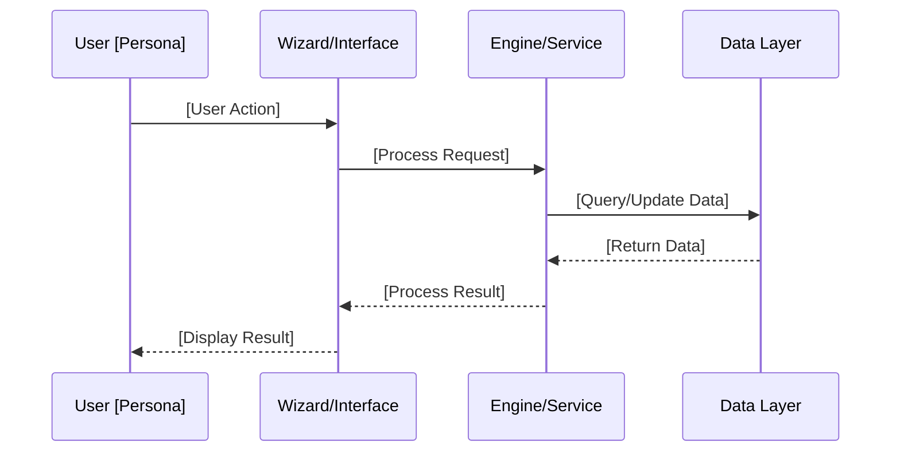
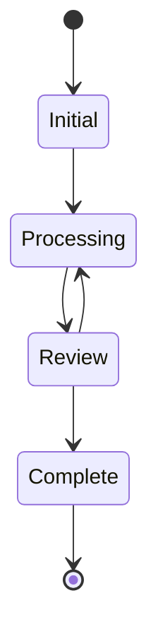
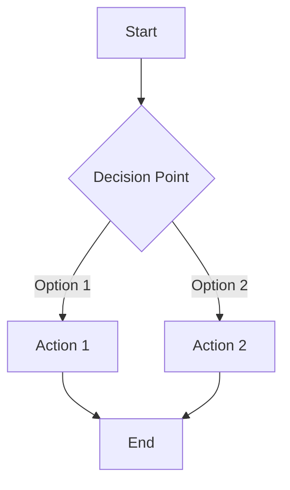
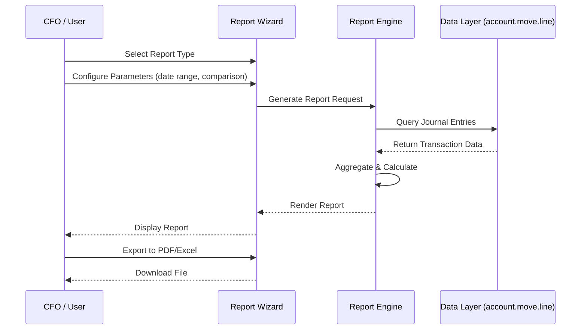

# [FEATURE-NNN] [Feature Title]

> **Reusable Feature Specification Template**
> 
> This template provides a consistent structure for documenting features within an epic. Features group related user stories that deliver a cohesive set of capabilities. Copy this template and replace all placeholders (indicated by `[brackets]`) with actual content.

---

## Metadata

| Attribute | Value |
|-----------|-------|
| **Feature ID** | `[FEATURE-NNN]` |
| **Title** | [Feature Title] |
| **Parent Epic** | [EPIC-NNN: Epic Title](../EPIC-001-enterprise-accounting.md) |
| **Status** | Draft / Ready / In Development / Complete |
| **Priority** | Critical / High / Medium / Low |
| **Story Count** | [N] stories |
| **Last Updated** | [YYYY-MM-DD] |
| **Owner/Author** | [Name / Team] |

---

## 1. Feature Overview

### 1.1 Purpose and Business Value

[Describe the purpose of this feature and the business value it delivers. Focus on outcomes for users, not implementation details.]

**Template:**
> This feature enables [target users] to [capability] by providing [key functionality]. It addresses [business need] and delivers [measurable benefit].

**Example:**
> This feature enables Finance Directors and Accountants to generate GAAP/IFRS-compliant financial reports by providing automated report generation with comparative periods and drill-down capabilities. It addresses regulatory compliance requirements and delivers reduced manual effort for period-end reporting.

### 1.2 Problem Statement

[Describe the specific problem this feature addresses. Be specific about the pain points users currently experience.]

**Template:**
> Currently, [target users] must [current workaround/manual process] to achieve [desired outcome]. This results in [negative consequences: time, cost, errors, compliance risk].

**Example:**
> Currently, accountants must manually compile financial data from multiple sources and format reports in spreadsheets to produce Balance Sheets and P&L statements. This results in 40+ hours of effort per quarter, risk of calculation errors, and delayed reporting to stakeholders.

### 1.3 Key Capabilities

[List the key capabilities this feature delivers. Each capability should map to one or more user stories.]

| Capability ID | Capability Description | Related Stories |
|---------------|----------------------|-----------------|
| CAP-001 | [Capability description] | [Story IDs] |
| CAP-002 | [Capability description] | [Story IDs] |
| CAP-003 | [Capability description] | [Story IDs] |
| CAP-004 | [Capability description] | [Story IDs] |

**Example:**

| Capability ID | Capability Description | Related Stories |
|---------------|----------------------|-----------------|
| CAP-001 | Generate Balance Sheet report with asset/liability/equity sections | FR-001 |
| CAP-002 | Generate Profit & Loss statement with revenue/expense breakdown | FR-002 |
| CAP-003 | Compare current period with prior periods | FR-001, FR-002, FR-003 |
| CAP-004 | Export reports to PDF and Excel formats | FR-007 |

### 1.4 Success Criteria at Feature Level

[Define measurable success criteria for this feature as a whole. These should be verifiable upon feature completion.]

| Criterion | Target | Verification Method |
|-----------|--------|-------------------|
| [Criterion 1] | [Measurable target] | [How to verify] |
| [Criterion 2] | [Measurable target] | [How to verify] |
| [Criterion 3] | [Measurable target] | [How to verify] |

**Example:**

| Criterion | Target | Verification Method |
|-----------|--------|-------------------|
| All standard reports available | 100% coverage | Checklist verification |
| Report accuracy | Zero calculation errors | Reconciliation with source data |
| Performance | Reports generate in <30 seconds for typical datasets | Load testing |
| Test coverage | ≥80% for all story implementations | Code coverage tools |

---

## 2. User Personas

### 2.1 Persona Mapping

[Identify which personas benefit from this feature. Mark applicable personas and describe their primary use cases for this specific feature.]

| Persona | Role Description | Primary Use Cases | Applicable |
|---------|------------------|-------------------|------------|
| CFO / Finance Director | Executive responsible for financial strategy and reporting | [Use cases for this feature] | ☐ Yes / ☐ No |
| Accountant / Bookkeeper | Day-to-day financial operations and transaction processing | [Use cases for this feature] | ☐ Yes / ☐ No |
| Controller | Budget oversight and variance management | [Use cases for this feature] | ☐ Yes / ☐ No |
| Auditor | Transaction verification and compliance review | [Use cases for this feature] | ☐ Yes / ☐ No |
| Business Owner | Overall business health and cash position | [Use cases for this feature] | ☐ Yes / ☐ No |

**Example (for Financial Reporting feature):**

| Persona | Role Description | Primary Use Cases | Applicable |
|---------|------------------|-------------------|------------|
| CFO / Finance Director | Executive responsible for financial strategy and reporting | Review Balance Sheet, P&L for board presentations; Cash Flow for strategy | ☑ Yes |
| Accountant / Bookkeeper | Day-to-day financial operations and transaction processing | Generate General Ledger, Trial Balance for period close | ☑ Yes |
| Controller | Budget oversight and variance management | Compare actual vs budget in P&L | ☐ No (Budget feature) |
| Auditor | Transaction verification and compliance review | Drill-down in General Ledger; verify Trial Balance | ☑ Yes |
| Business Owner | Overall business health and cash position | Cash Flow statement; Aged Receivables for AR management | ☑ Yes |

### 2.2 Persona-to-Story Mapping Guidelines

When assigning personas to stories within this feature:

- **Primary Persona**: The user who most directly benefits from the story
- **Secondary Personas**: Other users who interact with the functionality
- Each story should have exactly one primary persona in the "As a..." statement
- Stories may serve multiple personas, but focus on the primary user's perspective
- Consider edge cases and administrative personas where applicable

---

## 3. Story List

### 3.1 User Stories

[List all user stories within this feature. Maintain 3-7 stories per feature per INVEST decomposition guidelines.]

| Story ID | Story Title | Persona | Priority | Status | Link |
|----------|-------------|---------|----------|--------|------|
| [XX-001] | [Story Title] | [Primary Persona] | Critical / High / Medium / Low | Draft / Ready / In Progress / Done | [Link](../stories/[feature-folder]/[XX]-001-[slug].md) |
| [XX-002] | [Story Title] | [Primary Persona] | Critical / High / Medium / Low | Draft / Ready / In Progress / Done | [Link](../stories/[feature-folder]/[XX]-002-[slug].md) |
| [XX-003] | [Story Title] | [Primary Persona] | Critical / High / Medium / Low | Draft / Ready / In Progress / Done | [Link](../stories/[feature-folder]/[XX]-003-[slug].md) |
| [XX-004] | [Story Title] | [Primary Persona] | Critical / High / Medium / Low | Draft / Ready / In Progress / Done | [Link](../stories/[feature-folder]/[XX]-004-[slug].md) |
| [XX-005] | [Story Title] | [Primary Persona] | Critical / High / Medium / Low | Draft / Ready / In Progress / Done | [Link](../stories/[feature-folder]/[XX]-005-[slug].md) |

**Example (for Financial Reporting feature):**

| Story ID | Story Title | Persona | Priority | Status | Link |
|----------|-------------|---------|----------|--------|------|
| FR-001 | Balance Sheet Report | CFO | Critical | Draft | [FR-001](../stories/financial-reporting/FR-001-balance-sheet-report.md) |
| FR-002 | Profit & Loss Statement | CFO | Critical | Draft | [FR-002](../stories/financial-reporting/FR-002-profit-loss-statement.md) |
| FR-003 | Cash Flow Statement | CFO | Critical | Draft | [FR-003](../stories/financial-reporting/FR-003-cash-flow-statement.md) |
| FR-004 | General Ledger Report | Accountant | High | Draft | [FR-004](../stories/financial-reporting/FR-004-general-ledger-report.md) |
| FR-005 | Trial Balance Report | Accountant | High | Draft | [FR-005](../stories/financial-reporting/FR-005-trial-balance-report.md) |
| FR-006 | Aged Receivable/Payable Reports | Accountant | High | Draft | [FR-006](../stories/financial-reporting/FR-006-aged-reports.md) |
| FR-007 | Report Export & Drill-down | Auditor | Medium | Draft | [FR-007](../stories/financial-reporting/FR-007-report-export-drilldown.md) |

### 3.2 Story Count Guidelines

Per INVEST decomposition principles:

| Count | Assessment | Action |
|-------|------------|--------|
| 1-2 stories | Feature may be too granular | Consider merging with a related feature |
| **3-7 stories** | **Optimal range** | Feature is well-scoped for independent delivery |
| 8+ stories | Feature may be too broad | Consider splitting into sub-features |

### 3.3 Story Dependency Ordering

[Document any dependencies between stories within this feature that affect implementation order.]

| Story | Depends On | Notes |
|-------|-----------|-------|
| [Story ID] | [Prerequisite Story IDs] | [Why this dependency exists] |

**Example:**

| Story | Depends On | Notes |
|-------|-----------|-------|
| FR-007 (Export & Drill-down) | FR-001, FR-002, FR-003, FR-004, FR-005, FR-006 | Export functionality requires reports to exist |
| FR-003 (Cash Flow) | FR-004 (General Ledger) | Cash flow derives from ledger transaction data |

---

## 4. Acceptance Criteria Summary

### 4.1 Feature-Level Acceptance Criteria

[Define high-level acceptance criteria that apply to the feature as a whole. These are NOT detailed BDD scenarios (those belong in individual stories).]

The feature is considered complete when:

- [ ] All stories within this feature have status "Done"
- [ ] All stories achieve minimum 80% test coverage
- [ ] Feature-level integration tests pass
- [ ] [Feature-specific criterion 1]
- [ ] [Feature-specific criterion 2]
- [ ] [Feature-specific criterion 3]

**Example (for Financial Reporting):**

The feature is considered complete when:

- [ ] All 7 stories within this feature have status "Done"
- [ ] All stories achieve minimum 80% test coverage
- [ ] Feature-level integration tests pass
- [ ] All 6 standard financial reports can be generated
- [ ] Reports support comparison with at least 2 prior periods
- [ ] All reports can be exported to PDF and Excel formats
- [ ] Report data reconciles with underlying journal entries

### 4.2 Cross-Cutting Concerns

[Document acceptance criteria that apply to ALL stories within this feature. Individual stories inherit these criteria.]

| Concern | Acceptance Criterion |
|---------|---------------------|
| License | All implementations use AGPL-3.0 compatible license |
| Dependencies | No imports from Odoo Enterprise modules |
| Coding Standards | Code passes OCA quality checks (pre-commit, pylint-odoo) |
| Test Coverage | Each story achieves minimum 80% test coverage |
| Documentation | Public APIs documented with docstrings |
| Security | Access rights properly configured for each user role |
| Performance | [Feature-specific performance requirements] |

### 4.3 Integration Requirements

[Document how this feature must integrate with other features in the epic or existing system functionality.]

| Integration Point | Requirement | Verification |
|-------------------|-------------|--------------|
| [Other Feature / Module] | [Integration requirement] | [How to verify] |

**Example:**

| Integration Point | Requirement | Verification |
|-------------------|-------------|--------------|
| Budget Management | P&L can display budget vs actual columns | Report shows variance correctly |
| Bank Reconciliation | Reconciled status reflected in General Ledger | GL marks reconciled transactions |
| `account.move` | Reports derive data from journal entries | Data reconciliation tests |
| `account.account` | Reports use account hierarchy | Proper grouping in reports |

### 4.4 Performance Requirements

[Specify any performance requirements for this feature. Not all features require explicit performance criteria.]

| Metric | Requirement | Measurement Method |
|--------|-------------|-------------------|
| [Performance metric] | [Target value] | [How to measure] |

**Example:**

| Metric | Requirement | Measurement Method |
|--------|-------------|-------------------|
| Report generation time | <30 seconds for 100,000 transactions | Load test with sample dataset |
| Export to Excel | <10 seconds for typical report | Timed export operation |
| Drill-down response | <2 seconds to load transaction details | UI interaction timing |

---

## 5. Constraints (Inherited from Epic)

### 5.1 License Requirements

| Constraint | Requirement | Rationale |
|------------|-------------|-----------|
| **License Compatibility** | AGPL-3.0 | All new modules must be distributed under AGPL-3.0 compatible license |
| **Existing License Respect** | LGPL-3 (base modules) | Integration with existing Odoo modules must respect their LGPL-3 licensing |

**Acceptance Criterion:** Module distributed under AGPL-3.0 compatible license.

### 5.2 Dependency Restrictions

| Constraint | Requirement | Rationale |
|------------|-------------|-----------|
| **No Enterprise Dependencies** | Zero imports from Enterprise Edition | Ensures solution works for Community Edition users |
| **OCA Compatibility** | Compatible with OCA modules | Allows integration with existing OCA ecosystem |

**Acceptance Criterion:** No imports or dependencies on Odoo Enterprise edition modules.

### 5.3 Coding Standards

| Constraint | Requirement | Rationale |
|------------|-------------|-----------|
| **Odoo Guidelines** | Follow Odoo coding standards | Consistency with Odoo ecosystem |
| **OCA Standards** | Adhere to OCA module guidelines | Enables potential OCA contribution |
| **PEP 8 Compliance** | Python code follows PEP 8 | Standard Python style compliance |

**Acceptance Criterion:** Code passes OCA quality checks (pre-commit hooks, pylint-odoo).

### 5.4 Test Coverage

| Constraint | Requirement | Rationale |
|------------|-------------|-----------|
| **Minimum Coverage** | 80% test coverage | Ensures reliability and maintainability |
| **Test Types** | Unit, Integration, Acceptance | Comprehensive testing at all levels |
| **BDD Alignment** | Tests match acceptance criteria | Stories are verifiable |

**Acceptance Criterion:** Implementation achieves minimum 80% test coverage.

### 5.5 Version Compatibility

| Constraint | Requirement | Notes |
|------------|-------------|-------|
| **Target Version** | Odoo [XX.0] | [Specify target Odoo version] |
| **Repository Version** | [Note any discrepancy] | [Migration considerations] |
| **Python Version** | Python 3.10+ | Odoo version-dependent |

**Note:** If the target version differs from the repository version, implementation agents should note potential migration considerations in their discovery phase.

---

## 6. Technical Discovery Notes

> **Purpose:** These notes guide implementing agents in their codebase analysis before making implementation decisions. User stories describe WHAT and WHY; implementation details emerge from agent discovery of the codebase.

### 6.1 Codebase Analysis Areas

[Identify specific areas of the codebase that implementing agents should analyze for this feature.]

| Analysis Area | Purpose | Key Questions |
|---------------|---------|---------------|
| [Module/Component] | [Why analyze this] | [What to determine] |

**Example (for Financial Reporting):**

| Analysis Area | Purpose | Key Questions |
|---------------|---------|---------------|
| `addons/account/report/` | Understand existing report patterns | How are current reports structured? QWeb templates or Python? |
| `addons/account/models/account_move.py` | Transaction data source | How to efficiently query for report data? |
| `addons/account/views/*_report*.xml` | Report UI patterns | How are report wizards implemented? |

### 6.2 Existing Odoo Modules to Examine

[List existing Odoo modules that contain relevant patterns or integration points for this feature.]

| Module | Path | Relevance to This Feature |
|--------|------|--------------------------|
| [Module name] | `addons/[module]/` | [What patterns to study] |

**Example:**

| Module | Path | Relevance to This Feature |
|--------|------|--------------------------|
| `account` | `addons/account/` | Core accounting models, existing report infrastructure |
| `analytic` | `addons/analytic/` | Analytic account integration for reports |
| `base` | `odoo/addons/base/` | Partner and company models |

### 6.3 OCA Module Compatibility Considerations

[Identify OCA modules that provide similar or related functionality. Agents should determine integration vs. replacement strategy.]

| OCA Module | Repository | Consideration |
|------------|------------|---------------|
| [Module name] | [OCA repo link] | [Integration vs. replacement decision factors] |

**Example:**

| OCA Module | Repository | Consideration |
|------------|------------|---------------|
| `account_financial_report` | OCA/account-financial-reporting | Provides General Ledger, Trial Balance, Aged Reports - evaluate for extension vs. replacement |
| `report_xlsx` | OCA/reporting-engine | Excel export functionality - potential integration |

### 6.4 Integration Points

[Document the key integration points between this feature and existing Odoo models/modules.]

| Integration Point | Model/Module | Integration Type | Notes |
|-------------------|--------------|------------------|-------|
| [Description] | [Model name] | Read / Write / Extend | [Implementation notes] |

**Example:**

| Integration Point | Model/Module | Integration Type | Notes |
|-------------------|--------------|------------------|-------|
| Transaction data | `account.move` | Read | Query journal entries for reports |
| Line items | `account.move.line` | Read | Aggregate by account for reports |
| Account hierarchy | `account.account` | Read | Group accounts for report sections |
| Partner data | `res.partner` | Read | Customer/vendor details for aged reports |
| Company settings | `res.company` | Read | Currency, fiscal year settings |

### 6.5 Discovery vs. Prescription Guidelines

> **Important:** User stories and feature specifications describe WHAT functionality is needed and WHY users need it. They do NOT prescribe HOW to implement.

**DO NOT specify in user stories:**
- Specific model names or field definitions
- Database schema decisions
- UI component architecture (OWL vs. legacy)
- Specific Odoo API methods to use
- Module structure or file organization

**DO defer to agent discovery:**
- D-001: Model inheritance patterns (extension vs. new model)
- D-002: OCA module integration strategy
- D-003: Report engine approach (QWeb vs. dedicated)
- D-004: UI component patterns
- D-005: Data model extension approach

---

## 7. Dependencies

### 7.1 Related Features

[Document relationships with other features in the epic.]

| Feature | ID | Relationship | Notes |
|---------|-----|--------------|-------|
| [Feature name] | [FEATURE-NNN] | Prerequisite / Successor / Parallel / Related | [How they interact] |

**Example:**

| Feature | ID | Relationship | Notes |
|---------|-----|--------------|-------|
| Budget Management | FEATURE-003 | Related | P&L can show budget vs actual comparison |
| Bank Reconciliation | FEATURE-002 | Related | Reconciled status reflected in GL |

### 7.2 Required Odoo Modules

[List existing Odoo modules required for this feature to function.]

| Module | Technical Name | Dependency Type | Purpose |
|--------|---------------|-----------------|---------|
| [Module name] | [technical.name] | Required / Optional | [Why needed] |

**Example:**

| Module | Technical Name | Dependency Type | Purpose |
|--------|---------------|-----------------|---------|
| Invoicing | `account` | Required | Core accounting models |
| Analytic Accounting | `analytic` | Required | Analytic dimension support |
| Portal | `portal` | Optional | External user report access |

### 7.3 External Standards and Specifications

[List external standards or specifications that this feature must comply with or reference.]

| Standard | Reference | Application to This Feature |
|----------|-----------|----------------------------|
| [Standard name] | [Document/section] | [How it applies] |

**Example:**

| Standard | Reference | Application to This Feature |
|----------|-----------|----------------------------|
| GAAP | US FASB ASC | Balance Sheet, P&L format and presentation |
| IFRS | IFRS Foundation Standards | International report format compliance |
| ISO 20022 | CAMT.053 | Bank statement format for reconciliation |

---

## 8. Feature Workflow Diagram

### 8.1 Workflow Visualization

[Include a Mermaid diagram showing the primary workflow for this feature. Choose the diagram type that best represents the feature's workflow.]

**Sequence Diagram Template:**

**State Diagram Template:**

**Flowchart Template:**

### 8.2 Diagram Instructions

When customizing the workflow diagram:

1. **Choose the appropriate diagram type:**
   - **Sequence**: For user-system interactions with clear request/response flow
   - **State**: For entities with distinct lifecycle states
   - **Flowchart**: For decision-based processes with branching logic

2. **Customize for your feature:**
   - Replace participant names with actual personas and components
   - Document the happy path first
   - Add error handling paths if they clarify the workflow
   - Keep diagrams focused on user-observable behavior

3. **Mermaid syntax resources:**
   - [Mermaid Official Docs](https://mermaid.js.org/intro/)
   - [Sequence Diagram Syntax](https://mermaid.js.org/syntax/sequenceDiagram.html)
   - [State Diagram Syntax](https://mermaid.js.org/syntax/stateDiagram.html)
   - [Flowchart Syntax](https://mermaid.js.org/syntax/flowchart.html)

### 8.3 Example Workflow (Financial Reporting)

---

## 9. Related Documentation

### 9.1 Epic Reference

| Document | Link |
|----------|------|
| Parent Epic | [EPIC-NNN: Epic Title](../EPIC-001-enterprise-accounting.md) |

### 9.2 Story Files

| Story | Link |
|-------|------|
| [Story ID]: [Story Title] | [Link to story file](../stories/[feature-folder]/[XX]-001-[slug].md) |
| [Story ID]: [Story Title] | [Link to story file](../stories/[feature-folder]/[XX]-002-[slug].md) |
| [Story ID]: [Story Title] | [Link to story file](../stories/[feature-folder]/[XX]-003-[slug].md) |

### 9.3 External References

| Resource | URL | Purpose |
|----------|-----|---------|
| OCA Repository | [https://github.com/OCA/[repo]] | [Relevant modules/patterns] |
| Odoo Documentation | [https://www.odoo.com/documentation/[version]/...] | [Relevant docs] |
| Standard Documentation | [URL or reference] | [How it applies] |

**Example:**

| Resource | URL | Purpose |
|----------|-----|---------|
| OCA account-financial-reporting | https://github.com/OCA/account-financial-reporting | Financial report module patterns |
| Odoo Accounting Docs | https://www.odoo.com/documentation/18.0/applications/finance/accounting.html | Official accounting documentation |
| FASB ASC | https://asc.fasb.org/ | US GAAP accounting standards |

---

## 10. Revision History

| Version | Date | Author | Changes |
|---------|------|--------|---------|
| 0.1 | [YYYY-MM-DD] | [Author] | Initial draft |
| 0.2 | [YYYY-MM-DD] | [Author] | [Description of changes] |
| 1.0 | [YYYY-MM-DD] | [Author] | Approved for implementation |

**Revision Guidelines:**
- Update version number for significant changes
- Document story additions/removals, priority changes, scope adjustments
- Maintain history for audit trail and context

---

## Template Usage Instructions

### How to Use This Template

1. **Copy this template** to create a new feature specification
2. **Rename the file** following the pattern: `FEATURE-NNN-[slug].md`
   - Example: `FEATURE-001-financial-reporting.md`
3. **Replace all placeholders** (text in `[brackets]`) with actual content
4. **Remove template instructions** (sections like this one) after filling in content
5. **Customize sections** as needed:
   - Remove optional sections not applicable
   - Add custom sections if required
   - Adjust tables to match your story count

### Placeholder Reference

| Placeholder | Description | Example |
|-------------|-------------|---------|
| `[FEATURE-NNN]` | Feature identifier | FEATURE-001 |
| `[Feature Title]` | Descriptive title | Financial Reporting |
| `[EPIC-NNN]` | Parent epic ID | EPIC-001 |
| `[YYYY-MM-DD]` | Date in ISO format | 2024-01-15 |
| `[XX-001]` | Story ID | FR-001 |
| `[feature-folder]` | Story subdirectory name | financial-reporting |
| `[slug]` | URL-friendly name | balance-sheet-report |
| `[N]` | Numeric count | 7 |
| `[XX.0]` | Odoo version | 18.0 |

### Story ID Prefixes by Feature

| Feature | Story Prefix | Example |
|---------|--------------|---------|
| Financial Reporting | FR | FR-001, FR-002 |
| Bank Reconciliation | BR | BR-001, BR-002 |
| Budget Management | BM | BM-001, BM-002 |
| Asset Management | AM | AM-001, AM-002 |
| Deferred Revenue | DR | DR-001, DR-002 |
| Payment Follow-ups | PF | PF-001, PF-002 |

### Quality Checklist

Before finalizing the feature specification, verify:

- [ ] All placeholders replaced with actual content
- [ ] 3-7 stories listed (per INVEST guidelines)
- [ ] All stories have links to story files in correct location (`../stories/[feature-folder]/`)
- [ ] Persona mapping completed with applicable checkboxes
- [ ] Feature-level acceptance criteria defined
- [ ] Constraints section includes all epic-inherited requirements
- [ ] Technical discovery notes guide implementation agents
- [ ] Mermaid diagram renders correctly
- [ ] All relative links are valid
- [ ] Revision history initialized
- [ ] Template instructions removed from final document

### Related Templates

| Template | Purpose | Link |
|----------|---------|------|
| Epic Template | Master epic documentation | [epic-template.md](./epic-template.md) |
| Story Template | Individual user story documentation | [story-template.md](./story-template.md) |

---

*This template follows INVEST principles and BDD best practices for feature specification documentation. Features should contain 3-7 user stories, each with BDD acceptance criteria. For the parent epic structure, see [epic-template.md](./epic-template.md). For individual story format, see [story-template.md](./story-template.md).*
